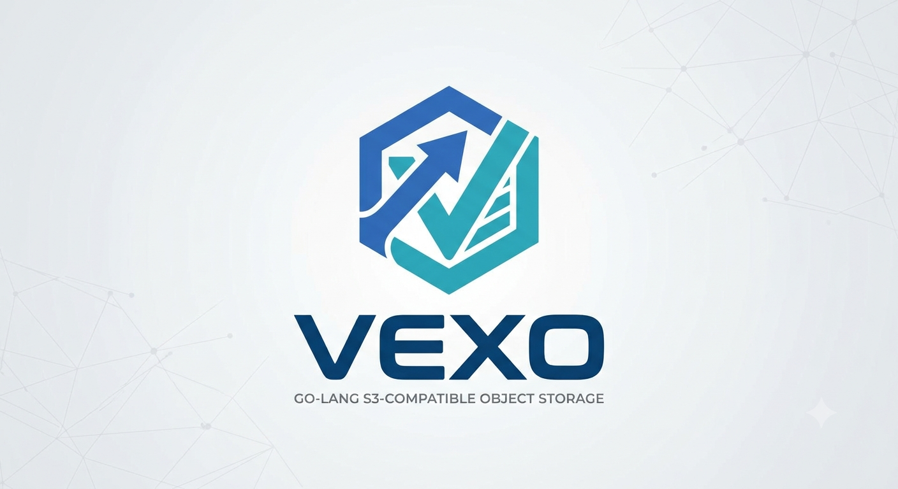

<p align="center">
  
</p>

# vexo

A single-node, S3-compatible object store written in Go. vexo speaks a real HTTP S3 API (SigV4-signed, XML responses), enforces AWS-style IAM policies, and automatically tiers objects between hot/infrequent/cold storage based on lifecycle rules — all backed by a single embedded [bbolt](https://github.com/etcd-io/bbolt) metadata file.

> Work in progress. See [Status](#status) for what's implemented vs. planned.

## Features

- **S3 HTTP API** — `PUT`/`GET`/`HEAD`/`DELETE` for buckets and objects, `ListBuckets`, `ListObjectsV2`-style listing with prefix filtering, XML error responses shaped like AWS's. Works against `net/http`'s `ServeMux` on port `:9090`.
- **AWS SigV4 authentication** — requests are verified using the same `AWS4-HMAC-SHA256` canonical-request/signing-key chain as real S3, so existing SigV4 clients (aws-cli, boto3, mc) are the intended clients once wired up.
- **IAM** — users, groups, and access keys stored in bbolt. A root user + access key is bootstrapped on first run and written once to `volume/.vexo.root.key`.
- **JSON policy engine** — AWS IAM-style policy documents (`Effect`/`Action`/`Resource`, glob wildcards, explicit `Deny` wins) evaluated on every authenticated request against the caller's user and group policies.
- **Lifecycle & tiering** — per-bucket lifecycle rules (`Transition` by days-since-access, `Expiration` by days-since-creation) drive objects through three tiers:
  - `hot` — `volume/<bucket>/<id>`
  - `infrequent` — `volume/<bucket>/.infrequent/<id>`
  - `cold` — `volume/<bucket>/.cold/<id>.gz` (gzip-compressed)

  A background scanner goroutine (60s tick) evaluates rules across all buckets and performs transitions/expirations. Reads always work regardless of tier (transparent gzip decompression) and update `lastAccessedAt`/`accessCount` inline.
- **Web console** — a Vue 3 + TypeScript SPA (`web/`) for browsing buckets/objects, managing users, access keys, and policies through a cookie-session JSON API, served on `:9091`.
- **Internal TCP transport** — a lightweight custom binary-framed protocol (`internal/p2p`) on `:3001`, used as an alternate ingest path independent of the HTTP/S3 surface.
- **Embedded metadata store** — everything (buckets, objects, users, groups, policies) lives in one `bbolt` file at `volume/.vexo.meta.db`. No external database.

## Getting started

### Build

```sh
make build          # -> bin/fs (main server)
make build-client    # -> bin/client (TCP test client)
```

### Run

```sh
make run
```

On first start, if no IAM users exist yet, vexo creates a root user (`VEXO_ROOT_USER`, defaults to `zaki`) with a fresh access key, prints the credentials once, and saves them to `volume/.vexo.root.key` (mode `0600`).

Ports (currently fixed, not yet flag-configurable):

| Service              | Address  |
|----------------------|----------|
| S3 HTTP API          | `:9090`  |
| Web console          | `:9091`  |
| Internal TCP ingest  | `:3001`  |

### Test

```sh
make test
```

## Disk layout

```
volume/
  .vexo.meta.db          # bbolt metadata (buckets, objects, users, groups, policies)
  .vexo.root.key          # root access key + secret, written once
  <bucket>/
    <object-id>           # hot tier
    .infrequent/<id>       # infrequent tier
    .cold/<id>.gz          # cold tier, gzip-compressed
```

## Web console

```sh
cd web
npm install
npm run dev
```

The console talks to the JSON API exposed by `internal/console` (login, buckets, objects, users, access keys, policies) — separate from the S3-compatible SigV4 API used by S3 clients.

## Status

Implemented: bbolt metadata store, bucket CRUD, object put/get/head/delete/list, S3 HTTP server, IAM (users/groups/access keys), JSON policy engine, SigV4 auth middleware, lifecycle rule model + tiering, scanner goroutine, web console.

Planned: lifecycle configuration via `?lifecycle` XML sub-resource on the S3 API, migrating the TCP path onto the shared object store, a proper S3-CLI-compatible client (or documenting aws-cli/mc usage directly), multipart upload.
